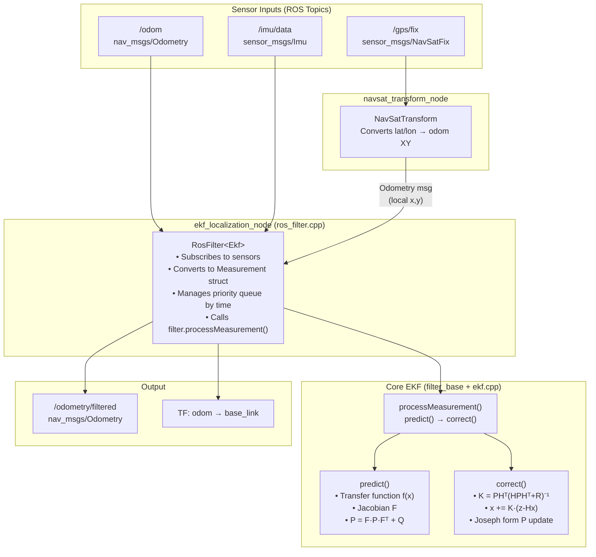

# 🎯 robot_localization EKF — Complete Exam-Ready Deep Dive

> **Chunk 1 of 2**: This document covers the EKF algorithm, state vector, predict/correct cycle, and every file in the package.
> **Chunk 2** (NavSat Transform) will come next.

---

## 1. What Problem Does This Package Solve?

Your robot has **multiple sensors** (wheel odometry, IMU, GPS), and each is noisy and incomplete:

| Sensor | What it gives | What it can't do |
|---|---|---|
| Wheel Odometry | Local x, y, yaw, speeds | Drifts over time, no global reference |
| IMU | Orientation, angular velocity, acceleration | No position, bias drift |
| GPS | Global lat/lon | Noisy (1 m random walk), low frequency (10 Hz), no orientation |

**The EKF fuses all of them** into one optimal state estimate that is better than any single sensor alone.

---

## 2. The 15-Element State Vector

> [!IMPORTANT]
> This is the most critical thing in the entire package. Every single file revolves around this vector.

Defined in [filter_common.hpp](file:///home/anish/Multi-sensor-fusion/src/robot_localization/include/robot_localization/filter_common.hpp#L42-L59):

```
Index  Name           Symbol    Unit      Meaning
──────────────────────────────────────────────────────
 0     StateMemberX      x      meters    Position X (world frame)
 1     StateMemberY      y      meters    Position Y (world frame)
 2     StateMemberZ      z      meters    Position Z (world frame)
 3     StateMemberRoll   ϕ      radians   Roll  (rotation about X)
 4     StateMemberPitch  θ      radians   Pitch (rotation about Y)
 5     StateMemberYaw    ψ      radians   Yaw   (rotation about Z)
 6     StateMemberVx     ẋ      m/s       Linear velocity X (body frame)
 7     StateMemberVy     ẏ      m/s       Linear velocity Y (body frame)
 8     StateMemberVz     ż      m/s       Linear velocity Z (body frame)
 9     StateMemberVroll  ϕ̇      rad/s     Angular velocity roll
10     StateMemberVpitch θ̇      rad/s     Angular velocity pitch
11     StateMemberVyaw   ψ̇      rad/s     Angular velocity yaw
12     StateMemberAx     ẍ      m/s²      Linear acceleration X
13     StateMemberAy     ÿ      m/s²      Linear acceleration Y
14     StateMemberAz     z̈      m/s²      Linear acceleration Z
```

The state vector is stored as:

```cpp
// In filter_base.hpp, line 424
Eigen::VectorXd state_;   // size = STATE_SIZE = 15
```

Think of it like this: **the EKF is always maintaining its best guess of these 15 numbers**, and every sensor measurement updates some subset of them.

---

## 3. The EKF Algorithm — Theory, Then Code

### 3.1 The Standard EKF Equations (What You Write in an Exam)

The EKF has exactly **5 equations**, split into two phases:

#### PREDICT Phase (a.k.a. "Time Update")

```
(Eq 1)  x̂⁻ₖ = f(x̂ₖ₋₁, uₖ)           ← Predicted state
(Eq 2)  P⁻ₖ  = Fₖ · Pₖ₋₁ · Fₖᵀ + Q    ← Predicted covariance
```

#### CORRECT Phase (a.k.a. "Measurement Update")

```
(Eq 3)  Kₖ  = P⁻ₖ · Hᵀ · (H · P⁻ₖ · Hᵀ + R)⁻¹   ← Kalman Gain
(Eq 4)  x̂ₖ  = x̂⁻ₖ + Kₖ · (zₖ − H · x̂⁻ₖ)          ← Corrected state
(Eq 5)  Pₖ  = (I − Kₖ·H) · P⁻ₖ · (I − Kₖ·H)ᵀ + Kₖ·R·Kₖᵀ  ← Joseph form
```

Where:
- **x̂** = state vector (15×1)
- **P** = estimate error covariance (15×15) — "how uncertain are we?"
- **F** = Jacobian of the motion model f() — the linearization
- **Q** = process noise covariance (15×15) — "how much error does prediction add?"
- **H** = observation matrix — maps state to what the sensor actually measures
- **R** = measurement noise covariance — "how noisy is this sensor?"
- **K** = Kalman gain — "how much should we trust the measurement vs prediction?"
- **z** = actual measurement vector
- **(z − Hx̂⁻)** = "innovation" — "how surprised are we by this measurement?"

> [!TIP]
> **The Kalman Gain K is the heart of the whole algorithm.** If R (sensor noise) is very large → K becomes small → we trust the prediction more. If P (our uncertainty) is large → K becomes large → we trust the measurement more.

---

### 3.2 How `robot_localization` Implements Each Equation

#### 3.2.1 PREDICT — [ekf.cpp Ekf::predict()](file:///home/anish/Multi-sensor-fusion/src/robot_localization/src/ekf.cpp#L217-L437)

This is where the **3D omnidirectional motion model** lives. Let me break it down line by line.

**Step 1: Build the Transfer Function f(x)** (lines 255–295)

The transfer function encodes: "If I know my current orientation (roll, pitch, yaw) and my body-frame velocities (vx, vy, vz), where will I be after dt seconds?"

For a ground robot, the key rows are:

```
x_new = x + (cy·cp · Vx + (cy·sp·sr - sy·cr) · Vy + (cy·sp·cr + sy·sr) · Vz) · dt
y_new = y + (sy·cp · Vx + (sy·sp·sr + cy·cr) · Vy + (sy·sp·cr - cy·sr) · Vz) · dt
```

This is the **3D rotation matrix** (ZYX Euler angles) applied to body-frame velocities to get world-frame displacements:

```
         ┌ cy·cp    cy·sp·sr−sy·cr    cy·sp·cr+sy·sr ┐
R_ZYX =  │ sy·cp    sy·sp·sr+cy·cr    sy·sp·cr−cy·sr │  × dt
         └ −sp      cp·sr             cp·cr           ┘
```

Where `cy = cos(yaw)`, `sy = sin(yaw)`, `cp = cos(pitch)`, `sp = sin(pitch)`, `cr = cos(roll)`, `sr = sin(roll)`.

**For your 2D ground robot** (roll=0, pitch=0): this simplifies to:
```
x_new = x + cos(yaw) · Vx · dt
y_new = y + sin(yaw) · Vx · dt
```

Accelerations also contribute via **½·a·dt²** terms (lines 260–265).

**Step 2: Build the Jacobian F** (lines 299–381)

Because f(x) is nonlinear (has sin/cos terms), we can't use it directly for covariance propagation. We need its **Jacobian** (matrix of partial derivatives):

```
F[i][j] = ∂f_i / ∂x_j
```

The code computes things like:
```cpp
// ∂(x_new)/∂(roll)
dFx_dR = (cy·sp·cr+sy·sr)·Vy + (-cy·sp·sr+sy·cr)·Vz) · dt
```

Most entries of the Jacobian are identical to the transfer function itself (lines 368). The extra entries are the derivatives w.r.t. roll, pitch, yaw (because positions depend on orientation via the rotation matrix).

**Step 3: Apply the Equations**

```cpp
// Eq 1: x̂⁻ = f(x, u)
state_ = transfer_function_ * state_;                    // Line 416

// Eq 2: P⁻ = F·P·Fᵀ + Q
estimate_error_covariance_ =
    transfer_function_jacobian_ * estimate_error_covariance_ *
    transfer_function_jacobian_.transpose();              // Lines 427-429
estimate_error_covariance_ += delta_sec * process_noise_covariance_;  // Line 430-431
```

> [!NOTE]
> The process noise Q is **multiplied by dt** (delta_sec). This means longer time steps → more added uncertainty, which makes physical sense.

---

#### 3.2.2 CORRECT — [ekf.cpp Ekf::correct()](file:///home/anish/Multi-sensor-fusion/src/robot_localization/src/ekf.cpp#L49-L215)

This is the measurement update. The critical insight here is the **partial update** system.

**Step 1: Build Subsets** (lines 73–155)

Not every sensor measures all 15 state variables. The `update_vector_` boolean array tells us which ones a given sensor provides. For example, wheel odometry might only set `[true, true, false, false, false, false, false, false, false, false, false, true, false, false, false]` (only x, y, vyaw).

The code builds **smaller matrices** containing only the relevant entries:

```cpp
// H matrix: state_to_measurement_subset
// It's basically: H[i, update_indices[i]] = 1
for (size_t i = 0; i < update_size; ++i) {
    state_to_measurement_subset(i, update_indices[i]) = 1;
}
```

> [!IMPORTANT]
> **This is a linear observation model** (H is 0s and 1s). This means the filter assumes sensors directly observe state variables — no nonlinear sensor model needed. GPS lat/lon → x,y conversion is handled *outside* the filter by `navsat_transform`.

**Step 2: Compute Kalman Gain** (lines 165–171)

```cpp
// K = P·Hᵀ · (H·P·Hᵀ + R)⁻¹
Eigen::MatrixXd pht = P * H.transpose();          // P·Hᵀ
Eigen::MatrixXd hphr_inverse = (H * pht + R).inverse();  // (H·P·Hᵀ + R)⁻¹
K = pht * hphr_inverse;                           // K = P·Hᵀ · (...)⁻¹
```

**Step 3: Compute Innovation** (lines 173–183)

```cpp
innovation = z - Hx;    // How different is measurement from prediction?

// IMPORTANT: Wrap angle differences to [-π, π]
if (index == Roll || Pitch || Yaw) {
    innovation(i) = normalize_angle(innovation(i));
}
```

**Step 4: Mahalanobis Distance Check** (lines 186–189)

Before applying the correction, the filter checks if the measurement is an **outlier**:

```cpp
d² = innovationᵀ · (H·P·Hᵀ + R)⁻¹ · innovation
if (d² > threshold²) → REJECT the measurement
```

This prevents a single bad GPS reading from ruining your entire state estimate.

**Step 5: Apply Correction** (lines 192–202)

```cpp
// Eq 4: x = x + K·(z - Hx)
state_ += K * innovation;

// Eq 5: P = (I - K·H)·P·(I - K·H)ᵀ + K·R·Kᵀ   (Joseph form)
gain_residual = I - K * H;
P = gain_residual * P * gain_residual.transpose() + K * R * K.transpose();
```

> [!NOTE]
> The **Joseph form** (instead of the simpler `P = (I-KH)P`) is used because it's numerically more stable. It guarantees P stays symmetric and positive-definite even with floating-point roundoff errors.

---

## 4. The processMeasurement Flow (Where It All Comes Together)

Defined in [filter_base.cpp](file:///home/anish/Multi-sensor-fusion/src/robot_localization/src/filter_base.cpp#L194-L264):

```
┌─────────────────────────────────────┐
│   New measurement arrives (z, R)    │
└──────────────────┬──────────────────┘
                   │
           ┌───────▼────────┐
           │ initialized_?  │
           └───┬────────┬───┘
               │        │
          NO   │        │  YES
               │        │
    ┌──────────▼─┐  ┌───▼────────────────────┐
    │ Set state  │  │ delta = t_now - t_last  │
    │ to first   │  │                         │
    │ measurement│  │ if delta > 0:           │
    │            │  │   PREDICT(delta)        │
    │ Set P from │  │                         │
    │ measurement│  │ CORRECT(measurement)    │
    │ covariance │  └─────────────────────────┘
    └────────────┘
```

**First measurement** → Directly sets the state (no predict/correct yet, just initializes).
**Every subsequent measurement** → Full predict/correct cycle.

---

## 5. File-by-File Breakdown

### 5.1 Header Files (`include/robot_localization/`)

| File | Purpose |
|---|---|
| [filter_common.hpp](file:///home/anish/Multi-sensor-fusion/src/robot_localization/include/robot_localization/filter_common.hpp) | **The enum** that defines the 15-state indices + constants (STATE_SIZE=15, etc.) |
| [filter_state.hpp](file:///home/anish/Multi-sensor-fusion/src/robot_localization/include/robot_localization/filter_state.hpp) | Struct to store a filter snapshot: `{state_, P_, last_time_}` — used for history/replay |
| [measurement.hpp](file:///home/anish/Multi-sensor-fusion/src/robot_localization/include/robot_localization/measurement.hpp) | Struct holding one measurement: `{z, R, update_vector, time, topic_name, mahalanobis_thresh}` |
| [filter_base.hpp](file:///home/anish/Multi-sensor-fusion/src/robot_localization/include/robot_localization/filter_base.hpp) | **Abstract base class**: declares [predict()](file:///home/anish/Multi-sensor-fusion/src/robot_localization/src/ekf.cpp#217-438), [correct()](file:///home/anish/Multi-sensor-fusion/src/robot_localization/src/ekf.cpp#49-216) as pure virtual; stores state_, P, Q, F, F_jacobian, identity_ |
| [ekf.hpp](file:///home/anish/Multi-sensor-fusion/src/robot_localization/include/robot_localization/ekf.hpp) | `class Ekf : public FilterBase` — just declares the overrides for predict() and correct() |
| [ros_filter.hpp](file:///home/anish/Multi-sensor-fusion/src/robot_localization/include/robot_localization/ros_filter.hpp) | **The ROS interface layer** (templated on EKF/UKF). Handles subscriptions, TF, parameter loading, odometry publishing |
| [ros_filter_types.hpp](file:///home/anish/Multi-sensor-fusion/src/robot_localization/include/robot_localization/ros_filter_types.hpp) | Type aliases: `RosEkf = RosFilter<Ekf>`, `RosUkf = RosFilter<Ukf>` |
| [navsat_transform.hpp](file:///home/anish/Multi-sensor-fusion/src/robot_localization/include/robot_localization/navsat_transform.hpp) | Converts GPS lat/lon/alt ↔ local XY using UTM (covered in Chunk 2) |
| [navsat_conversions.hpp](file:///home/anish/Multi-sensor-fusion/src/robot_localization/include/robot_localization/navsat_conversions.hpp) | Math for lat/lon → UTM conversion (covered in Chunk 2) |

### 5.2 Source Files (`src/`)

| File | Lines | Purpose |
|---|---|---|
| [filter_base.cpp](file:///home/anish/Multi-sensor-fusion/src/robot_localization/src/filter_base.cpp) | 453 | [processMeasurement()](file:///home/anish/Multi-sensor-fusion/src/robot_localization/src/filter_base.cpp#194-265) (predict→correct loop), [reset()](file:///home/anish/Multi-sensor-fusion/src/robot_localization/src/filter_base.cpp#71-128), [prepareControl()](file:///home/anish/Multi-sensor-fusion/src/robot_localization/src/filter_base.cpp#352-381), [checkMahalanobisThreshold()](file:///home/anish/Multi-sensor-fusion/src/robot_localization/src/filter_base.cpp#431-452), [wrapStateAngles()](file:///home/anish/Multi-sensor-fusion/src/robot_localization/src/filter_base.cpp#421-430) |
| [ekf.cpp](file:///home/anish/Multi-sensor-fusion/src/robot_localization/src/ekf.cpp) | 440 | **The actual EKF math**: [predict()](file:///home/anish/Multi-sensor-fusion/src/robot_localization/src/ekf.cpp#217-438) with 3D transfer function + Jacobian, [correct()](file:///home/anish/Multi-sensor-fusion/src/robot_localization/src/ekf.cpp#49-216) with Kalman gain + Joseph form |
| [ros_filter.cpp](file:///home/anish/Multi-sensor-fusion/src/robot_localization/src/ros_filter.cpp) | ~4000 | **Largest file**. ROS integration: subscribes to odom/pose/twist/imu topics, converts messages to Measurement structs, manages time, publishes odom output, broadcasts TF |
| [ekf_node.cpp](file:///home/anish/Multi-sensor-fusion/src/robot_localization/src/ekf_node.cpp) | 60 | Entry point: creates a `RosEkf` node and spins it |
| [navsat_transform.cpp](file:///home/anish/Multi-sensor-fusion/src/robot_localization/src/navsat_transform.cpp) | ~1000 | GPS ↔ local frame converter (Chunk 2) |
| [navsat_transform_node.cpp](file:///home/anish/Multi-sensor-fusion/src/robot_localization/src/navsat_transform_node.cpp) | 60 | GPS node entry point |
| [ukf.cpp](file:///home/anish/Multi-sensor-fusion/src/robot_localization/src/ukf.cpp) | 500 | UKF alternative (Unscented Kalman Filter — uses sigma points instead of Jacobians) |

### 5.3 Architecture Diagram



---

## 6. The Config File (ekf.yaml) — What Each Parameter Means

See [ekf.yaml](file:///home/anish/Multi-sensor-fusion/src/robot_localization/params/ekf.yaml):

### 6.1 Core Parameters

| Parameter | Value | Meaning |
|---|---|---|
| `frequency` | 30.0 | EKF runs at 30 Hz (outputs state estimate 30 times/sec) |
| `sensor_timeout` | 0.1 | If no sensor data for 0.1s, do predict-only (keeps the estimate alive) |
| `two_d_mode` | false | If true, zeroes out z, roll, pitch, vz, vroll, vpitch — for planar robots |
| `publish_tf` | true | Broadcasts the odom → base_link transform |
| `world_frame` | odom | The frame the EKF estimates in. Set to `map` if fusing GPS |

### 6.2 Sensor Inputs

Each sensor is named like `odom0`, `imu0`, `pose0`, `twist0` (numbered 0, 1, 2... for multiple).

The **config vector** (15 booleans) is the `update_vector_` — telling the filter which of the 15 state vars this sensor measures:

```yaml
#               x     y     z     roll  pitch yaw   vx    vy    vz    vroll vpitch vyaw  ax    ay    az
odom0_config: [true, true, false, false, false, false, false, false, false, false, false, true, false, false, false]
```

This says: "From odometry, use X, Y, and Vyaw. Ignore everything else."

### 6.3 Advanced Sensor Parameters

| Parameter | Meaning |
|---|---|
| `differential` | Convert absolute pose to velocity by differentiating. Useful when two sensors both measure pose (avoids fighting). |
| `relative` | Treat first measurement as zero reference point |
| `pose_rejection_threshold` | Mahalanobis distance threshold — measurements too far from current state are rejected as outliers |

### 6.4 Process Noise Covariance (Q matrix)

The 15×15 diagonal matrix. **This is the most important tuning parameter.**

- **Large Q values** → filter trusts measurements more (state estimate follows measurements closely but may be jittery)
- **Small Q values** → filter trusts its prediction more (smoother but may be slow to react)

```yaml
process_noise_covariance: [
   0.05,  ...,                    # x — position uncertainty grows at this rate
   ..., 0.05, ...,                # y
   ..., ..., 0.06, ...,           # z
   ...                            # and so on for all 15 variables
]
```

---

## 7. Exam Quick-Reference: Write This in Your Answer

### "Describe the EKF algorithm as used in robot_localization"

**Answer Structure:**

1. **State Vector**: 15-element vector `x = [x, y, z, ϕ, θ, ψ, ẋ, ẏ, ż, ϕ̇, θ̇, ψ̇, ẍ, ÿ, z̈]ᵀ`

2. **Motion Model**: Uses 3D rigid-body kinematics with ZYX Euler rotation matrix to convert body-frame velocities to world-frame position changes. Nonlinear because of sin/cos terms.

3. **Predict Step**:
   - Apply transfer function: `x⁻ = f(x, u)` using the rotation matrix
   - Compute Jacobian F analytically (partial derivatives of the rotation)
   - Propagate covariance: `P⁻ = F·P·Fᵀ + Δt·Q`

4. **Correct Step**:
   - Build observation matrix H (only 0s and 1s — linear observation model)
   - Compute Kalman Gain: `K = P⁻Hᵀ(HP⁻Hᵀ + R)⁻¹`
   - Innovation: `ν = z - Hx⁻` (with angle wrapping for roll/pitch/yaw)
   - Mahalanobis outlier check: reject if `νᵀ(HP⁻Hᵀ+R)⁻¹ν > threshold²`
   - Update state: `x = x⁻ + Kν`
   - Update covariance (Joseph form): `P = (I-KH)P⁻(I-KH)ᵀ + KRKᵀ`

5. **Key Design Choices**:
   - Partial state updates via `update_vector_` (not every sensor updates all 15 states)
   - Joseph form for numerical stability of covariance
   - Dynamic process noise: scales Q by velocity norm when robot is moving
   - Sensor timeout: runs predict-only if no measurements arrive

---

*Next: **Chunk 2 — NavSat Transform** (how GPS lat/lon becomes local XY for the EKF)*
