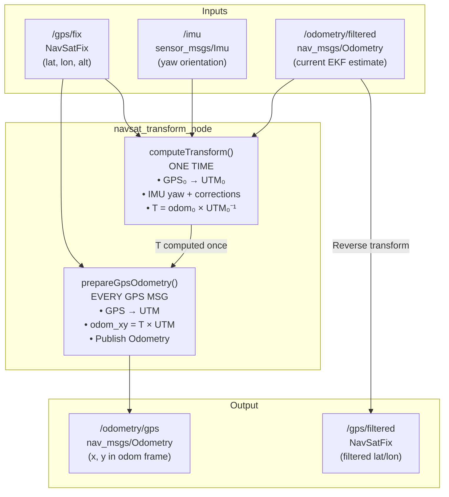
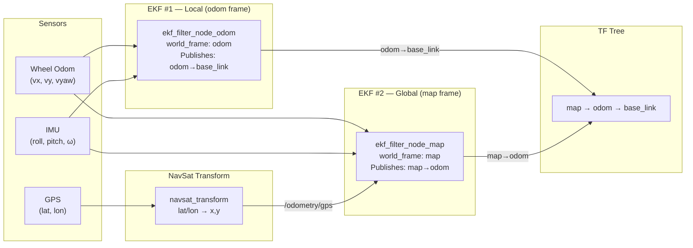

# 🌍 NavSat Transform — Complete Exam-Ready Deep Dive (Chunk 2)

> How GPS lat/lon becomes local XY that the EKF can actually fuse.

---

## 1. The Problem NavSat Transform Solves

The EKF works in a **local Cartesian frame** (meters: x, y, z). GPS gives you **geodetic coordinates** (degrees: latitude, longitude, altitude on an ellipsoid). You can't directly subtract two lat/lon values to get a distance in meters — the Earth is curved, and 1° of longitude varies from 111 km at the equator to 0 km at the poles.

**navsat_transform_node** is the bridge:

```
GPS (lat/lon/alt)  →  navsat_transform  →  Odometry (x, y in meters)  →  EKF
```

---

## 2. The Coordinate Conversion: Lat/Lon → Meters

### 2.1 UTM (Universal Transverse Mercator)

The primary method used. UTM divides the Earth into 60 zones (each 6° of longitude wide) and projects each zone onto a flat 2D surface.

**Key properties:**
- Output is **Easting (X)** and **Northing (Y)** in meters
- Easting has a **500,000 m false easting** (so values are always positive)
- Northing has a **10,000,000 m false northing** in the Southern hemisphere
- Scale factor k₀ = 0.9996 on the central meridian

Defined in [navsat_conversions.hpp](file:///home/anish/Multi-sensor-fusion/src/robot_localization/include/robot_localization/navsat_conversions.hpp):

```cpp
// WGS84 Ellipsoid Parameters
#define WGS84_A  6378137.0         // semi-major axis (equatorial radius)
#define WGS84_B  6356752.31424518  // semi-minor axis (polar radius)
#define WGS84_E  0.0818191908      // first eccentricity
#define UTM_K0   0.9996            // scale factor
#define UTM_FE   500000.0          // false easting
```

The math (simplified):
```
UTM_Easting  = 500000 + k₀ · N · [A + (1-T+C)A³/6 + ...]
UTM_Northing = FN + k₀ · [M + N·tan(ϕ)·(A²/2 + ...)]

where:
  ϕ = latitude, λ = longitude
  N = a / √(1 - e²·sin²ϕ)    ← radius of curvature
  T = tan²ϕ
  C = e'²·cos²ϕ
  A = (λ - λ₀)·cosϕ           ← λ₀ is the central meridian
  M = meridional arc distance
```

### 2.2 Local Cartesian (Alternative)

When `use_local_cartesian: true`, uses GeographicLib's `LocalCartesian` projection instead. This creates a **tangent plane** at the GPS origin — East-North-Up (ENU). More accurate for small areas, but doesn't have the zone concept.

```cpp
// In navsat_transform.cpp
gps_local_cartesian_.Forward(latitude, longitude, altitude,
                             cartesian_x, cartesian_y, cartesian_z);
```

---

## 3. The Transform Pipeline — Step by Step

This is the core algorithm. It runs inside [computeTransform()](file:///home/anish/Multi-sensor-fusion/src/robot_localization/src/navsat_transform.cpp#L235-L350).

### Phase 1: Gather Three Things

NavSat transform waits until it has **all three inputs** before computing the transform:

| Input | Source topic | What it provides | Flag |
|---|---|---|---|
| GPS fix | `/gps/fix` | First lat/lon position → UTM origin point | `has_transform_gps_` |
| IMU | `/imu` | Initial heading (yaw) → rotation angle | `has_transform_imu_` |
| Odometry | `/odometry/filtered` | Current odom-frame pose → alignment point | `has_transform_odom_` |

### Phase 2: Compute the One-Time Transform

Once all three are available:

```
Step 1: Convert first GPS reading to UTM
         GPS(lat₀, lon₀) → UTM(E₀, N₀)   [transform_cartesian_pose_]

Step 2: Correct for GPS sensor offset from robot center
         Use TF: base_link → gps_link to remove the offset

Step 3: Get initial heading from IMU, correct for:
         • Magnetic declination (mag north ≠ true north)
         • yaw_offset (IMU mounting offset)
         • UTM meridian convergence (UTM grid ≠ true east)

         corrected_yaw = imu_yaw + mag_declination + yaw_offset + meridian_convergence

Step 4: Compute the odom ↔ UTM transform:
         T_cartesian_to_world = T_odom_initial × T_utm_initial⁻¹
```

```cpp
// Line 324-326 in navsat_transform.cpp — THE KEY EQUATION:
cartesian_world_transform_.mult(
    transform_world_pose_yaw_only,          // where robot thinks it is (odom frame)
    cartesian_pose_with_orientation.inverse() // where GPS says it is (UTM frame)
);
```

This gives you a **single static transform** that converts any UTM coordinate to the odom frame.

### Phase 3: Convert Every Subsequent GPS Reading

For every new GPS fix after initialization:

```
1. Convert GPS(lat, lon) → UTM(E, N)                     [gpsFixCallback]
2. Apply transform: odom_pose = T_cartesian_to_world × UTM(E, N)   [cartesianToMap]
3. Publish as nav_msgs/Odometry on /odometry/gps         [prepareGpsOdometry]
4. EKF fuses this as a position measurement (x, y)
```

```cpp
// The conversion (line 476):
transformed_cartesian_gps.mult(cartesian_world_transform_, cartesian_pose);
```

### Visual Pipeline



---

## 4. The Dual-EKF Architecture (Why Two EKFs?)

This is the recommended pattern for GPS fusion. Defined in [dual_ekf_navsat_example.yaml](file:///home/anish/Multi-sensor-fusion/src/robot_localization/params/dual_ekf_navsat_example.yaml).

### The Problem with One EKF

GPS data causes **discrete jumps** in position. If you fuse GPS into the same EKF that publishes `odom → base_link`, those jumps go directly into your local planner — the robot jitters and jerks.

### The Solution: Two EKFs

```
EKF #1 ("odom")                    EKF #2 ("map")
─────────────────                  ─────────────────
world_frame: odom                  world_frame: map
Publishes: odom → base_link       Publishes: map → odom

Fuses:                             Fuses:
  • Wheel odometry (velocity)        • Wheel odometry (velocity)
  • IMU (orientation + ang vel)      • IMU (orientation + ang vel)
                                     • GPS odometry (x,y from navsat)

Result: SMOOTH, continuous         Result: GLOBALLY ACCURATE,
no jumps, drifts over time         may have small jumps
```



### What Each EKF Subscribes To

| | EKF Local (odom) | EKF Global (map) |
|---|---|---|
| `odom0` | `odometry/wheel` → vx, vy, vz, vyaw | `odometry/wheel` → vx, vy, vz, vyaw |
| `odom1` | — | `odometry/gps` → **x, y** |
| `imu0` | roll, pitch, ω_roll, ω_pitch, ω_yaw, ax, ay, az | roll, pitch, ω_roll, ω_pitch, ω_yaw, ax, ay, az |
| `world_frame` | **odom** | **map** |

> [!IMPORTANT]
> **Notice**: The map EKF does NOT fuse yaw from GPS. GPS has no heading information — heading comes from the IMU and wheel odometry only. The GPS only contributes absolute **x, y position**.

---

## 5. Config Parameters Explained

From [navsat_transform.yaml](file:///home/anish/Multi-sensor-fusion/src/robot_localization/params/navsat_transform.yaml):

| Parameter | Default | What it does |
|---|---|---|
| `magnetic_declination_radians` | 0.0 | Difference between magnetic north and true north at your location. **Find yours at [ngdc.noaa.gov/geomag-web](http://www.ngdc.noaa.gov/geomag-web/)** |
| `yaw_offset` | 0.0 | If your IMU doesn't read 0 when facing east (ENU convention), add the offset here |
| `zero_altitude` | false | Force altitude = 0 in output (useful for ground robots) |
| `use_odometry_yaw` | false | Get heading from odom instead of IMU. **Dangerous** — only if odom yaw is world-referenced |
| `wait_for_datum` | false | If true, uses manual datum instead of first GPS fix |
| [datum](file:///home/anish/Multi-sensor-fusion/src/robot_localization/src/navsat_transform.cpp#352-368) | [lat, lon, yaw] | Manual origin point (used when `wait_for_datum: true`) |
| `publish_filtered_gps` | false | Publish EKF-filtered position back as a NavSatFix message |
| `broadcast_cartesian_transform` | false | Broadcast the odom↔UTM static transform on `/tf_static` |
| `delay` | 0.0 | Wait N seconds before computing transform (gives other nodes time to start) |

> [!CAUTION]
> **ENU Convention**: `robot_localization` assumes ALL data is in **East-North-Up** frame. Many IMUs (like MPU6050) report in NED (North-East-Down). If your IMU reports 0 yaw facing **north**, set `yaw_offset: 1.5708` (π/2) so that 0 yaw = east.

---

## 6. Exam Quick-Reference: NavSat Transform

### "How does robot_localization handle GPS data?"

**Answer:**

1. **GPS cannot be directly fused** into the EKF because it provides lat/lon (degrees on a curved Earth), not local x/y (meters in a flat frame).

2. **navsat_transform_node** converts GPS to local coordinates:
   - Uses **UTM projection** (or Local Cartesian) to convert lat/lon → meters (easting, northing)
   - Computes a **one-time static transform** between UTM frame and odom frame using:
     - First GPS fix (provides UTM origin)
     - IMU heading (provides rotation, corrected for magnetic declination)
     - Current odom pose (provides alignment)
   - For every subsequent GPS fix: converts to UTM → applies transform → publishes as `nav_msgs/Odometry`

3. **Dual-EKF architecture** prevents GPS jumps from affecting local navigation:
   - **EKF #1** (odom frame): Fuses wheel odom + IMU only → smooth, continuous, drifts over time
   - **EKF #2** (map frame): Fuses wheel odom + IMU + GPS → globally accurate, may have small jumps
   - TF tree: `map → odom → base_link` (EKF #2 corrects the drift of EKF #1)

4. **Key formula**: `T_cartesian_to_world = T_odom₀ × T_utm₀⁻¹`

---

## 7. Connecting Back to Your Robot

For your Husarion Lynx, tying it all together:

| Component | Your Robot | Topic |
|---|---|---|
| GPS sensor | u-blox M8N (10 Hz) | `/gps/fix` |
| IMU | BMI088-class (200 Hz) | `/imu/data` |
| Wheel Odom | diff_drive_controller | `/diff_drive_controller/odom` |
| NavSat output | GPS → local x,y | `/odometry/gps` |
| EKF output | Fused state estimate | `/odometry/filtered` |

Your [controllers.yaml](file:///home/anish/Multi-sensor-fusion/src/husarion_ugv_description/config/controllers.yaml) already has `enable_odom_tf: false` — this is correct for the dual-EKF setup because the EKF should be publishing the odom→base_link transform, not the diff_drive_controller.

---

*← See also: [Chunk 1 — EKF Deep Dive](file:///home/anish/.gemini/antigravity/brain/26cfac95-662d-4ccb-9d5f-8629afd695e2/ekf_deep_dive.md)*
