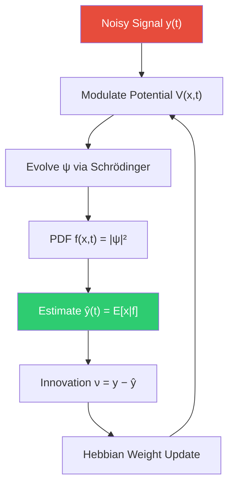

# 🧠 RQNN EEG Filtering — Explained Like You're 5

**Paper**: Gandhi, Prasad, Coyle, Behera & McGinnity (IEEE TNNLS, 2014)  
*"Quantum Neural Network-Based EEG Filtering for a Brain–Computer Interface"*

---

## The Problem: Brain Signals Are Super Noisy

Imagine you're trying to listen to your friend whispering in a really loud playground. That whisper is your **brain signal (EEG)** and the playground noise is all the junk — eye blinks, muscle movements, power-line hum, random electrical fuzz.

Before a Brain-Computer Interface (BCI) can understand what your brain is *trying* to say (like "move left hand"), it needs to **clean up the whisper** first. That's filtering.

### Why normal filters struggle

| Filter Type | What it does | Problem |
|---|---|---|
| Low-pass / Band-pass | Cuts frequencies above/below a range | Brain signals change frequency all the time! A fixed cutoff throws away useful stuff |
| Savitzky-Golay | Fits local polynomials | Pretty good, but assumes the signal is "smooth" — real EEG has sharp transients |
| Moving Average | Averages neighbours | Blurs everything, kills sharp features |
| Wavelet | Multi-scale decomposition | Needs you to pick the right wavelet and threshold — manual tuning |
| **RANSAC / Huber** | **Fits a straight line** | **Not even a signal filter — just robust linear regression. Useless for oscillatory signals** |

> [!IMPORTANT]
> RANSAC and Huber show terrible results in our comparison because they **fit a line** to the data, not the signal shape. They're robust *estimators*, not *filters*. Apples vs oranges.

---

## The Big Idea: What if a tiny quantum ball could "ride" your signal?

Picture a tiny ball sitting inside a bowl:

```
        .  ← ball rests at the bottom
       / \
      /   \
     /     \
    --------
```

If you move the bowl left, the ball rolls left. If you move it right, the ball rolls right. The ball **naturally follows** wherever the bowl's lowest point is.

**That's literally what RQNN does.**

- The **bowl** = a "potential field" shaped by the noisy signal
- The **ball** = a quantum wave packet (not literally quantum hardware — just the math)
- The ball's **position** = the cleaned signal value

Because the ball is quantum, it doesn't just sit still — it's a fuzzy cloud (a "wave packet") described by a probability distribution. The **peak of that cloud** is our best estimate of the clean signal.

---

## How It Actually Works (Step by Step)

### Step 1: Set Up a Spatial Grid (the "Neural Lattice")

Create a 1-D grid of points covering the expected signal range:

```
x: [−3.0, −2.97, −2.94, ... , +2.94, +2.97, +3.0]
     ↑                                            ↑
   x_min                                        x_max
```

Each grid point has:
- A **Gaussian kernel** g_i(x) = exp(−(x − c_i)² / 2σ²)  → a little bell curve
- A **weight** W_i(t)  → learned over time

### Step 2: Build the Potential Field (the "Bowl")

The potential has two parts:

```
V(x, t) = V_learned(x) + V_observation(x)
```

**V_learned** = Σ W_i · g_i(x) — a weighted sum of all the bell curves. The weights are learned from the signal history via Hebbian learning.

**V_observation** = γ · (x − y_obs)² — a **parabolic well centered on** the current noisy observation y_obs. This directly tells the wave packet: "hey, the signal is somewhere near here."

Together they create a bowl whose lowest point is the filter's best guess of the true signal:

```
V(x)
  ↑
  │   ╲              ╱      ← V_obs pulls toward y_obs
  │    ╲    ╱──╲    ╱       ← V_learned adds local structure  
  │     ╲__╱    ╲__╱
  └──────────────────→ x
              ↑
         minimum = estimate
```

### Step 3: Evolve the Wave Packet (Schrödinger Equation)

The wave packet ψ(x, t) lives on this grid and evolves according to the **time-dependent Schrödinger equation**:

```
iℏ ∂ψ/∂t = −(ℏ²/2m) ∂²ψ/∂x² + V(x,t) · ψ
             \_________________/   \________/
              kinetic energy       potential energy
              (makes it spread)    (confines it)
```

We solve this numerically using the **Crank-Nicolson** scheme (stable, accurate). The wave packet gets "squeezed" by the potential toward the true signal and "diffuses" a bit due to uncertainty — this natural tug-of-war is what does the filtering.

### Step 4: Extract the Signal Estimate

The probability density is:

```
f(x, t) = |ψ(x, t)|²
```

The cleaned signal estimate is the **expectation**:

```
ŷ(t) = ∫ x · f(x, t) dx    ← "where is the ball most likely?"
```

### Step 5: Learn the Weights (Hebbian Update)

After getting the estimate, compute the **innovation** (surprise):

```
ν(t) = y_obs(t) − ŷ(t)     ← how far off were we?
```

Update weights using a Hebbian rule with forgetting:

```
ΔW_i = β · ν · g_i(ŷ) − β_d · W_i
        ↑                    ↑
     learn from error     forget old stuff
```

- **β** = learning rate (how fast to adapt)
- **β_d** = de-learning rate (forgetting factor for non-stationary signals)

### Step 6: Repeat for Every Sample

Go back to Step 2 for the next time step. The filter is **online** — it processes one sample at a time, no look-ahead needed.

---

## Why It's Powerful



1. **Unsupervised** — no clean training data needed, learns on-the-fly
2. **No assumptions** — doesn't assume Gaussian noise, stationary signal, or any specific frequency band
3. **Adaptive** — the Hebbian learning + forgetting lets it track non-stationary signals (EEG changes every second)
4. **Natural smoother** — quantum mechanics inherently "averages out" high-energy (noisy) fluctuations while preserving low-energy (signal) dynamics

---

## PSO: Finding the Best Settings

The filter has 7 tunable knobs:

| Parameter | What it controls | Typical range |
|---|---|---|
| `mass` (m) | How "heavy" the wave packet is — heavier = slower to move, more smoothing | 0.5 – 5.0 |
| `sigma` (σ) | Width of the Gaussian kernels — wider = coarser potential | 0.1 – 2.0 |
| `beta` (β) | Learning rate — higher = faster adaptation | 0.05 – 1.0 |
| `beta_d` (β_d) | Forgetting rate — higher = less memory | 0.001 – 0.05 |
| `hbar` (ℏ) | "Quantum-ness" — higher = more wave spread | 0.5 – 3.0 |
| `gamma` (γ) | Observation-potential strength — higher = trusts observations more | 0.5 – 10.0 |
| `bias_strength` | Wave packet excitation from input | 0.1 – 0.8 |

**Particle Swarm Optimization (PSO)** is used to find the best combo:
- A swarm of "particles" each try different parameter combinations
- They share info about good regions  
- After ~40 iterations, they converge to the best settings for your specific signal

---

## TL;DR

> **RQNN treats your noisy signal as a "landscape" and lets a quantum wave packet slide through it. The wave packet naturally ignores noise (high-energy jitter) and follows the true signal (low-energy path). It learns with zero supervision and adapts in real-time.**

The paper shows this beats Savitzky-Golay filtering on EEG data when the parameters are properly tuned with PSO, because real EEG is highly non-stationary and non-Gaussian — exactly where classical fixed-parameter filters struggle.
